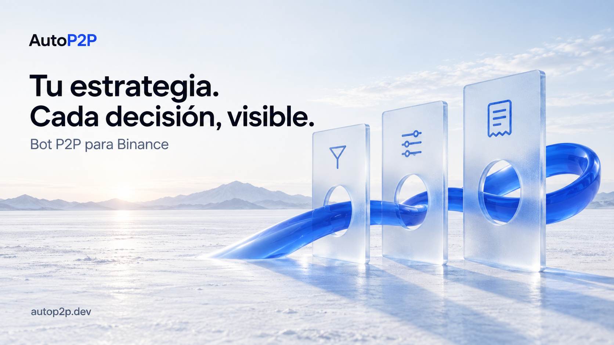

# AutoP2P — Bot P2P para Binance con repricing automático

**Tu estrategia. Cada decisión, visible.**

AutoP2P v2 es una plataforma web para operadores de **Binance P2P / C2C**: configurás cómo competir, definís límites de precio y revisás el motivo de cada decisión. Gestioná anuncios, órdenes y chat desde un mismo dashboard, sin instalar un bot ni administrar un VPS.

**[Conocer AutoP2P →](https://autop2p.dev/?utm_source=github&utm_medium=repository&utm_campaign=binance-p2p-bot&utm_content=readme_cta)** · [Ver estrategias](https://autop2p.dev/estrategias/) · [Consultar planes y acceso](https://autop2p.dev/precios/) · [Ingresar](https://app.autop2p.dev/login)

[English](README.en.md) · [Português](README.pt-BR.md)

> Este es el repositorio público de presentación y recursos de AutoP2P. No contiene el código del servicio ni un bot descargable. Para usar la plataforma, consultá las condiciones de acceso vigentes en el sitio oficial.

## Automatizá el precio de tus anuncios con tus reglas

Mantener anuncios competitivos exige revisar el libro, seleccionar referencias y respetar un rango. AutoP2P reúne esa configuración y el seguimiento de la operación en una herramienta web.

| Lo que necesitás | Cómo lo abordás con AutoP2P v2 |
| --- | --- |
| Ajustar precios sin repetir cambios manuales | Repricing por anuncio según estrategia, filtros y límites. |
| Comparar competidores relevantes | Filtros por medios de pago, volumen, límites de orden y otros criterios configurables. |
| Entender por qué cambió un precio | Un registro de decisión con el motivo de actualizar o mantener. |
| Gestionar varios anuncios | Configuración por anuncio y seguimiento desde el dashboard. |
| Trabajar desde el navegador | Anuncios, órdenes y chat en una plataforma en la nube. |
| Conservar el control operativo | Vos definís las reglas y decidís cuándo iniciar o pausar el motor. |

## Cómo funciona el bot P2P

1. **Conectá tu cuenta.** Seguí el proceso de la plataforma para configurar una API key con los permisos P2P requeridos, sin habilitar retiros.
2. **Definí tus reglas.** Elegí estrategia, competidores, rango de precio y horarios. Revisá la configuración antes de activar.
3. **Iniciá y supervisá.** El motor evalúa el mercado según tus reglas; podés consultar las decisiones y pausar la operación desde el dashboard.

La disponibilidad de una acción depende de los permisos de tu cuenta, la configuración y las condiciones de Binance. Calcular un precio candidato no significa que el cambio ya se haya aplicado.

## Estrategias de repricing: TOP1, FOLLOW y UNIFIED

| Estrategia | Comportamiento |
| --- | --- |
| **TOP1** | Calcula un precio frente a la competencia elegible, respetando la configuración del anuncio. |
| **FOLLOW** | Sigue la referencia de un competidor seleccionado por nickname. |
| **UNIFIED** | Selecciona la ruta TOP1 o FOLLOW según el modo de objetivo y los nicknames configurados. |

**Mantener el precio también es una decisión.** HOLD es un resultado del motor; no es una cuarta estrategia. Los límites, el tick y la banda mínima de cambio ayudan a definir cuándo corresponde actualizar.

[Explorar las estrategias de AutoP2P](https://autop2p.dev/estrategias/)

## Un dashboard para la operación P2P

- **Anuncios:** configuración individual y seguimiento del motor.
- **Órdenes y chat:** contexto de la operación y conversación con la contraparte.
- **Decisiones:** motivos de actualización o mantenimiento del precio.
- **Horarios:** ventanas de operación configurables.

[Ver el producto](https://autop2p.dev/producto/) · [Conocer el flujo para operadores P2P](https://autop2p.dev/para-operadores-p2p/)

## Seguridad y control

AutoP2P no custodia tus fondos. Configurá la API sin permisos de retiro y revisá sus permisos en Binance. El motor permanece apagado hasta que lo iniciás; la estrategia y los límites los definís vos.

La ausencia de custodia no elimina los riesgos de operar P2P. AutoP2P no promete beneficios, volumen de órdenes ni una posición permanente en el libro.

[Leer sobre seguridad y control](https://autop2p.dev/seguridad-y-control/)

## Preguntas frecuentes

### ¿Necesito un VPS o dejar la computadora encendida?

No necesitás administrar un servidor propio. AutoP2P se utiliza desde el navegador y el servicio corre en la nube.

### ¿Puedo descargar el bot desde este repositorio?

Este repositorio contiene material público del producto. El servicio se utiliza desde [la aplicación de AutoP2P](https://app.autop2p.dev/login); no hay un script para instalar ni código del motor publicado aquí.

### ¿Es un bot para trading spot o futuros?

AutoP2P está orientado a la operación de anuncios Binance P2P / C2C. No se presenta como un bot de señales para spot o futuros.

### ¿El bot garantiza el primer puesto o rentabilidad?

No. El resultado depende del mercado, los filtros, tus límites, los permisos y la disponibilidad de Binance. Una estrategia puede decidir mantener el precio en lugar de perseguir una posición.

### ¿Cuánto cuesta y cómo puedo acceder?

Consultá los [planes y condiciones vigentes](https://autop2p.dev/precios/). La duración de pruebas, el acceso y la disponibilidad de funciones se comunican en el sitio oficial.

### ¿AutoP2P pertenece a Binance?

No. AutoP2P es un producto independiente y no está afiliado a Binance. Binance es una marca de su respectivo titular.

## Guías para automatizar Binance P2P

- [Bot P2P para Binance: cómo elegir una herramienta](https://autop2p.dev/bot-p2p-binance/)
- [Automatizar Binance P2P](https://autop2p.dev/automatizar-binance-p2p/)
- [Usar un bot P2P sin VPS](https://autop2p.dev/bot-p2p-sin-vps/)
- [Glosario de la operación P2P](https://autop2p.dev/glosario/)
- [Novedades del producto](https://autop2p.dev/changelog/)

### Recursos por mercado

[Argentina](https://autop2p.dev/bot-p2p-argentina/) · [Colombia](https://autop2p.dev/bot-p2p-colombia/) · [Venezuela](https://autop2p.dev/bot-p2p-venezuela/) · [Brasil](https://autop2p.dev/bot-p2p-brasil/)

La disponibilidad de pares y medios de pago depende de tu cuenta y del mercado en Binance.

## Conocé AutoP2P

**[Explorar el producto y las opciones de acceso →](https://autop2p.dev/?utm_source=github&utm_medium=repository&utm_campaign=binance-p2p-bot&utm_content=readme_footer)**

[WhatsApp](https://wa.me/59893349147) · [hello@autop2p.dev](mailto:hello@autop2p.dev) · [Estado del servicio](https://status.autop2p.dev)

La portada es una ilustración conceptual de marca, no una captura del dashboard. [Recursos y criterios editoriales](docs/marketing.md).
